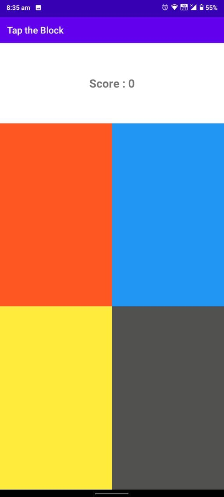
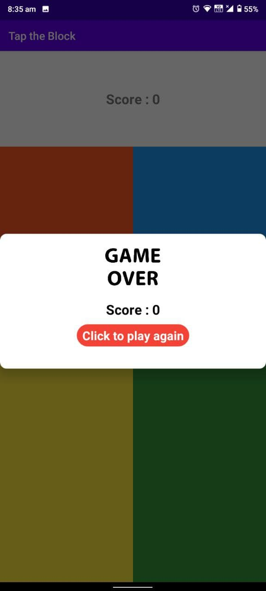
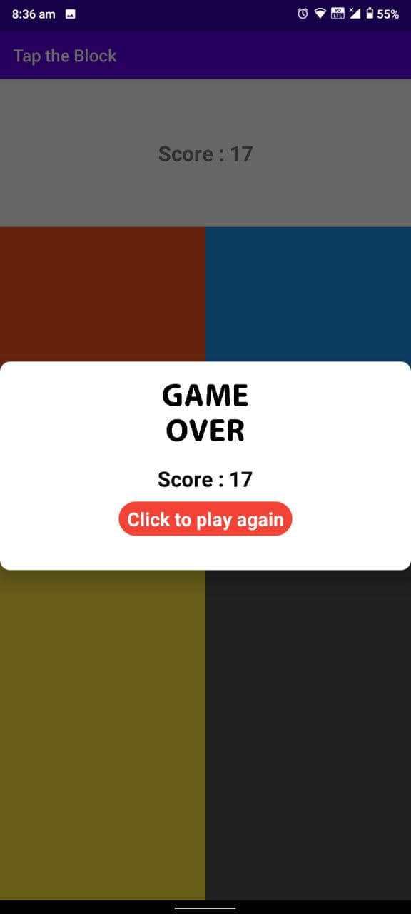
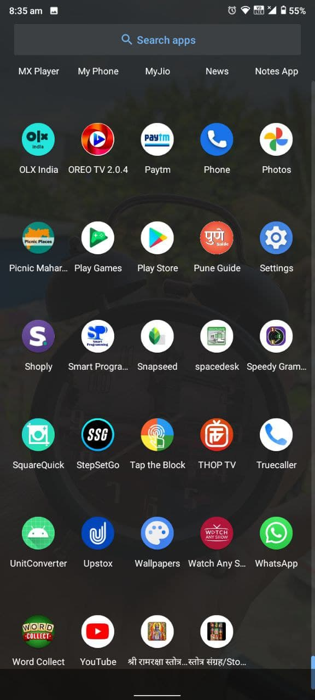

# TaponBlock
## Description
* This is very small game based on Android Studio, Java & XML.
* In this game you can play with blocks when any block background is
gray then you can tap on it.
* The score is increased by one. and you missed the tap or you can tap
on other than gray color block then its shows game over.
* Tech Stack :- Android Studio, XML & JAVA.

## Screenshots

### Home Screen

### Game Over (Missed the Tap)

### Game Over (On Wrong Tap)

### App Icon

### Project Explanation

https://user-images.githubusercontent.com/70057381/124415336-4646fe00-dd72-11eb-99ad-951b8ed240a7.mp4
